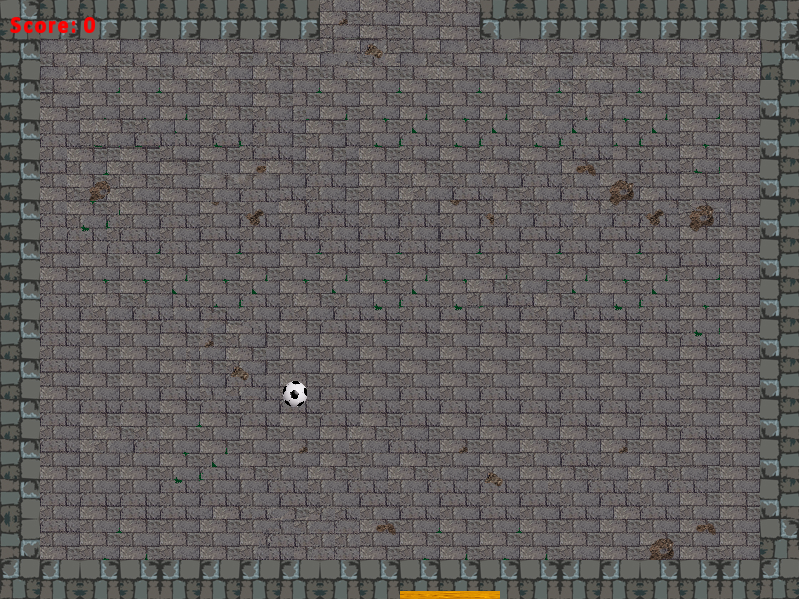

# Pong
Implementation of Pong Game in C++ using SFML library



## Prerequisites

### Install GLFW
```bash
$ sudo apt install libglfw3-dev
```

## Build & Run
assuming you are in root directory

**Build Pong using:** 
```bash
make 
```

**Run using:** 
```bash
make run
```

**Clean build files using:** 
```bash
make clean
```

## Controls
move paddle using `left-arrow` and `right-arrow` keys.
quit game using `esc` key